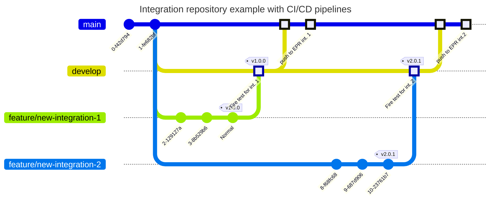

# Custom integrations

##  1. <a name='Overview'></a>Overview

This repository contains custom integrations.

###  1.1. <a name='TableofContent'></a>Table of Content

<!-- vscode-markdown-toc -->
* 1. [Overview](#Overview)
	* 1.1. [Table of Content](#TableofContent)
* 2. [Requirements](#Requirements)
	* 2.1. [GIT](#GIT)
		* 2.1.1. [macOS](#macOS)
		* 2.1.2. [Linux](#Linux)
	* 2.2. [Golang](#Golang)
	* 2.3. [Elastic-package](#Elastic-package)
	* 2.4. [Docker](#Docker)
* 3. [Integrations](#Integrations)
	* 3.1. [Create your integration](#Createyourintegration)
		* 3.1.1. [Add an input](#Addaninput)
		* 3.1.2. [Add a wonderfull Logo & Documentation](#AddawonderfullLogoDocumentation)

<!-- vscode-markdown-toc-config
	numbering=true
	autoSave=true
	/vscode-markdown-toc-config -->
<!-- /vscode-markdown-toc -->

##  2. <a name='Requirements'></a>Requirements

For the following demonstration, you'll need the following tools installed on your machine :

1. Git
2. Golang
3. Elastic-package
4. Docker

If you are planning to use this repository as a template to deliver your own custom integration to your company, you'll also need to have a CI/CD solution. In this example we will use gitlab-ci as our CI/CD solution. You can find more information about gitlab-ci [here](https://docs.gitlab.com/ee/ci/).

###  2.1. <a name='GIT'></a>GIT

Before we dive into the world of integrations, you'll need to install git on your computer. Here's a brief overview of how to do so:

####  2.1.1. <a name='macOS'></a>macOS

**Homebrew**

Install homebrew if you don't already have it, then:

```bash
brew install git
```

**Xcode**

Apple ships a binary package of Git with Xcode.

[Reference](https://git-scm.com/downloads/mac)

####  2.1.2. <a name='Linux'></a>Linux

**Debian/Ubuntu**

For the latest stable version for your release of Debian/Ubuntu

```bash
apt-get install git
```

For Ubuntu, this PPA provides the latest stable upstream Git version

```bash
add-apt-repository ppa:git-core/ppa
apt update
apt install git
```

**Fedora**

```bash
yum install git (up to Fedora 21)
dnf install git (Fedora 22 and later) 
```

[Reference](https://git-scm.com/downloads/linux)

###  2.2. <a name='Golang'></a>Golang

elastic-package is written in go and needs a specific version to use it. As a matter of simplicity we will use GVM (Go Version Manger) that will allow to install and manage mutiple version of Go.

**Linux (amd64)**

```bash
# Linux Example (assumes ~/bin is in PATH).
curl -sL -o /usr/local/bin/gvm https://github.com/andrewkroh/gvm/releases/download/v0.5.2/gvm-linux-amd64
chmod +x /usr/local/bin/gvm
eval "$(gvm 1.23.2)"
go version
```

**Linux (arm64)**

```bash
# Linux Example (assumes ~/bin is in PATH).
curl -sL -o /usr/local/bin/gvm https://github.com/andrewkroh/gvm/releases/download/v0.5.2/gvm-linux-arm64
chmod +x /usr/local/bin/gvm
eval "$(gvm 1.23.2)"
go version
```

**macOS (universal)**

```bash
# macOS Example
sudo curl -sL -o /usr/local/bin/gvm https://github.com/andrewkroh/gvm/releases/download/v0.5.2/gvm-darwin-all
sudo chmod +x /usr/local/bin/gvm
eval "$(gvm 1.23.2)"
go version
```

[Reference](https://github.com/andrewkroh/gvm)

###  2.3. <a name='Elastic-package'></a>Elastic-package

[Elastic-package](https://github.com/elastic/elastic-package) is a command line tool, written in Go, used for developing Elastic packages. It can help you lint, format, test and build your packages.

Download latest release from the [Releases](https://github.com/elastic/elastic-package/releases/latest) page.

On macOS, use `xattr -r -d com.apple.quarantine elastic-package` after downloading to allow the binary to run.

Recommended : Alternatively, you may use `go install` but you will not be able to use the `elastic-package version` command or check updates.

```bash
go install github.com/elastic/elastic-package@latest
```

_Please make sure that you've correctly [setup environment variables](https://golang.org/doc/gopath_code.html#GOPATH) -
`$GOPATH` and `$PATH`, and `elastic-package` is accessible from your `$PATH`._

Run the `help` command and see available commands:

```bash
elastic-package help
```

Once it's done, we will create a custom integrations.

###  2.4. <a name='Docker'></a>Docker

elastic-package provide a complete developpement environment to create Elastic Integrations. It will spin up a full containerized develkoppement environemnt using Docker.

**MacOS**
Download the Installer: Go to the official Docker website (https://www.docker.com/get-started) and download the macOS installer.

Run the Installer: Run the downloaded installer and follow the prompts to install Docker on your Mac.

**Fedora**
Install using DNF: Open a terminal and run sudo dnf install docker to install Docker using the DNF package manager.
Start the Service: Once installed, start the Docker service by running sudo systemctl start docker.
Enable the Service: To ensure the service starts automatically on boot, run sudo systemctl enable docker.

**Debian/Ubuntu**

Install using APT: Open a terminal and run ```sudo apt-get install docker.io``` to install Docker using the APT package manager.
Start the Service: Once installed, start the Docker service by running ```sudo systemctl start docker``` .
Enable the Service: To ensure the service starts automatically on boot, run ```sudo systemctl enable docker```.

##  3. <a name='Integrations'></a>Integrations

Now that all the requirements are met, we will start by creating a custom integration. For the purpose of this demonstration we will create an integration to cover [Ubika](https://www.ubikasec.com/en/) logs
As we are going to version the integrations, we will initialize the folder with the following command :

```bash
git init
```

###  3.1. <a name='Createyourintegration'></a>Create your integration

Now we can use elastic-package to create our custom integration. To do so, open a terminal and run the following command:

```bash
elastic-package create package
? Package type: integration
? Package name: ubika
? Version: 0.0.1
? License: Apache-2.0
? Package title: Ubika Application Security
? Description: UBIKA offers advanced solutions to detect, prevent, and respond to threats in real time, helping businesses ensure secure digital operations.
? Categories: security
? Kibana version constraint: ^8.15.3
? Required Elastic subscription: basic
? Github owner: fred-maussion/custom-integrations
? Owner type: community
New package has been created: ubika
Done

```

####  3.1.1. <a name='Addaninput'></a>Add an input

Upon integration creation, you can now add an input to your integration. To do so, open a terminal and run the following command :

```bash
cd ubika
```

And start the creation of the source input

```bash
elastic-package create data-stream
Create a new data stream
? Data stream name: logs
? Data stream title: Ubika Logs Stream
? Type: logs
? Enable creation of subobjects for fields with dots in their names? No
New data stream has been created: logs
Done
```

you can repeat the operation as many input as you have.

####  3.1.2. <a name='AddawonderfullLogoDocumentation'></a>Add a wonderfull Logo & Documentation 

**Logo**

In order to have a logo shown in Elastic's marketplace, you'll need an SVG file representing the product logo. Best practice is to place the SVG file in the img folder of your integration's folder and named `logo.svg`.

Once placed to the correct folder, you'll need to add the following line in your `manifest.yml` file :

```bash
...
icons:
  - src: /img/logo.svg <-- change here the name
    title: Sample logo
    size: 32x32
    type: image/svg+xml
...
```

**Documentation**

Elsatic intgeration proivide a way to add a documentation to your integration in order to ease customer implemantation. To do so, modify the exising `./docs/README.md` file and add a documentation based on your environment. Based on our Ubika example :

```bash
# Ubika Application Security

The Ubika Application Security integration allows you to monitor the Ubika WAAP (Web Application and API Protection) Gateway. Ubika WAAP is an advanced security solution designed to protect web applications and APIs from cyber threats, including SQL injection, XSS, and DDoS attacks.

Use the Ubika Application Security integration to collect and analyze security event data from Ubika WAAP. With this integration, you can visualize data in Kibana, set up alerts to notify you of suspicious activity, and troubleshoot issues by referencing collected logs.

For example, if you wanted to monitor for potential DDoS attacks, you could set an alert on request traffic spikes. Then you can visualize these events in Kibana, alert on anomalous patterns, and troubleshoot using detailed log data.

## Data streams

The Ubika Application Security integration collects one type of data stream: logs.

**Logs** capture a record of security events and traffic patterns processed by Ubika WAAP, such as:
- Threat detection events (e.g., SQL injections, XSS attempts)
- DDoS attack patterns
- API access and request logs

See the [Logs](#logs-reference) section for more details on these data streams.

## Requirements

- **Elasticsearch** is required for storing and searching the collected data.
- **Kibana** is necessary for visualizing and managing the data.
- This integration is compatible with Elastic Cloud (recommended) or a self-managed Elastic Stack deployment.
  
Additional requirements:
- **Ubika WAAP Gateway** must be configured to send logs to Elasticsearch.
- Ensure necessary permissions to view and access WAAP logs in Elasticsearch and Kibana.
  
## Setup

1. Follow the [Getting started](https://www.elastic.co/guide/en/welcome-to-elastic/current/getting-started-observability.html) guide to set up your Elastic Stack.

2. Configure Ubika WAAP to forward its log data to Elasticsearch:
   - Locate the log forwarding settings in the Ubika WAAP Gateway.
   - Set the destination to your Elastic-agent instance.
   - Verify that log formats are compatible with the Elastic integration.

3. In Kibana, set up alerts and visualizations as needed to monitor your security environment.

## Logs reference

### Threat Detection Logs

The `threat_detection` data stream provides logs for various types of attacks detected by Ubika WAAP, including:
- SQL injection attempts
- Cross-site scripting (XSS) events
- DDoS attack indicators

#### Example

An example event for `threat_detection` may look as follows:

```json
{
  "timestamp": "2024-11-13T12:34:56Z",
  "event_type": "threat_detection",
  "threat_type": "SQL Injection",
  "severity": "high",
  "source_ip": "192.168.1.100",
  "target": "/api/user",
  "details": "SQL Injection attempt detected in API request payload"
}
```

##### Add Processing, Mapping & Collection type

**Pipeline Creation**

In order to map the data in ECS we are going to creat the appropriate pipeline. For this, you can use the predefined ```default.yml``` pipeline file located under the folder :

```bash
Ubika
|
--- data_stream
------ logs
--------- _dev
--------- agent
--------- elasticsearch
------------ ingest_pipeline <--- pipeline location
....
```

In our case it will give the following pipeline :


```bash
---
description: "Pipeline to ingest Ubika WAAP logs and map to ECS format"
processors:
  - json:
      field: "message"
      target_field: "ubika"
  - set:
      field: "event.category"
      value: "web"
  - set:
      field: "event.type"
      value: "access"
  - set:
      field: "event.dataset"
      value: "ubika.waap"
  - rename:
      field: "ubika.timestamp"
      target_field: "@timestamp"
      ignore_missing: true
  - set:
      field: "host.name"
      value: "{{ubika.context.applianceName}}"
  - rename:
      field: "ubika.request.ipSrc"
      target_field: "client.ip"
      ignore_missing: true
  - rename:
      field: "ubika.request.ipDst"
      target_field: "destination.ip"
      ignore_missing: true
  - rename:
      field: "ubika.request.method"
      target_field: "http.request.method"
      ignore_missing: true
  - rename:
      field: "ubika.request.path"
      target_field: "url.path"
      ignore_missing: true
  - rename:
      field: "ubika.request.portDst"
      target_field: "destination.port"
      ignore_missing: true
  - rename:
      field: "ubika.request.hostname"
      target_field: "url.domain"
      ignore_missing: true
  - rename:
      field: "ubika.events[0].tokens.riskLevel"
      target_field: "event.risk_score"
      ignore_missing: true
  - rename:
      field: "ubika.events[0].tokens.eventType"
      target_field: "event.kind"
      ignore_missing: true
  - rename:
      field: "ubika.events[0].tokens.severity"
      target_field: "event.severity"
      ignore_missing: true
  - rename:
      field: "ubika.events[0].tokens.reason"
      target_field: "event.reason"
      ignore_missing: true
  - rename:
      field: "ubika.request.headers"
      target_field: "http.request.headers"
      ignore_missing: true
  - remove:
      field: "ubika"
      ignore_missing: true
```

**Mapping Creation**

Now the pipeline is complete we create the correct mapping. For this, you can use the predefined ```base-fields.yml``` file located under the folder :

```bash
Ubika
|
--- data_stream
------ logs
--------- _dev
--------- agent
--------- fields <--- mapping file location 
....
```

```bash
- name: "@timestamp"
  type: date
  description: "Event timestamp."
- name: "event.category"
  type: keyword
  description: "Event category, such as authentication, configuration, or web."
- name: "event.type"
  type: keyword
  description: "Event type, such as access, error, or info."
- name: "event.dataset"
  type: keyword
  description: "Dataset name for the event, in this case, `ubika.waap`."
- name: "event.risk_score"
  type: float
  description: "Risk score associated with the event."
- name: "event.kind"
  type: keyword
  description: "Kind of event, such as event or state."
- name: "event.severity"
  type: integer
  description: "Severity level of the event."
- name: "event.reason"
  type: text
  description: "Reason or explanation for the event."
- name: "host.name"
  type: keyword
  description: "Name of the host or appliance generating the event."
- name: "client.ip"
  type: ip
  description: "Source IP address of the client."
- name: "destination.ip"
  type: ip
  description: "Destination IP address."
- name: "destination.port"
  type: integer
  description: "Destination port number."
- name: "http.request.method"
  type: keyword
  description: "HTTP method used in the request, such as GET or POST."
- name: "http.request.headers"
  type: nested
  description: "HTTP headers sent in the request."
  properties:
    - name: "key"
      type: keyword
      description: "Header field name."
    - name: "value"
      type: text
      description: "Header field value."
- name: "url.path"
  type: keyword
  description: "Path portion of the URL."
- name: "url.domain"
  type: keyword
  description: "Domain of the URL."
```

**Collection Type**

##### Add the tests

In order to ensure quality in the integration, elastic-packacge can ensure the quality by adding test for each datastream of the integration.

For this go to the datastream you want to add test for and create the folder ```_dev``` at the root of the datastream; for example : 

```bash
Ubika
|
--- data_stream
------ logs
--------- _dev <--- create folder here
--------- agent
--------- elasticsearch
--------- fields
....
```

Now the folder exist you can add the test files (raw or event). In the case of this example we are going to add raw log files from the application.

 The naming 
for more information 

test
expected 


##### Validate that it's working

Now the in

```bash
elastic-package 
```


##### Build the intgration

Finally if all the test are working you can build the integration by running the following command : 

```bash
elastic-package build
```

The generated zip archive will be available at the root of the project under _build/packages/_

If you want to see the output in the elastic stack, you can spin up the stack using the following command who will integrate the generated package to the local EPR and serve it within Kibana under the integration sub menu.

```bash
elastic-package stack up -d --services package-registry
```

## CI/CD

In today's fast-paced development landscape, ensuring the quality and reliability of software integrations is crucial. One effective way to achieve this is by leveraging Continuous Integration/Continuous Deployment (CI/CD) pipelines. This approach automates the integration and deployment process, reducing errors and increasing efficiency.

In this context, we'll explore how to deploy an integration using CI/CD on the Elastic Package Registry (EPR), while ensuring the quality of the integration through the use of the Elastic-Package Testing Framework. We'll see the benefits of this approach, including:

* Automated testing and deployment: Streamlining the process to ensure faster time-to-market
* Reduced errors: Catching issues early on in the development cycle
* Increased confidence: Ensuring the integrity of the integration

By combining CI/CD with Elastic-Package Testing Framework, we'll see how to create a robust and reliable integration that meets the demands of modern software development. In the next section, we'll dive deeper into the specifics of this approach, including configuration, testing, and deployment best practices.

### Github / Gitlab

In this repository we're going to apply a simple CI scenario where every time a integration version is available it will trigger the CI/CD pipeline and generate a new package version containing the changelog and the archive.

We strongly suggest you adapt it to your needs on your production environment to something like :



You'll find two example a for both _gitlab-ci_ and _github-action_ at the root of the project and _.github_ folder.

## Expose them

TODO : Explain EPR architecuture and best practice to expose them

## TODO

1. Create workshop to create a ready to use integration


## Usefull links
1. https://www.elastic.co/guide/en/integrations-developer/current/quick-start.html
2. [Elastic package](https://github.com/elastic/elastic-package)