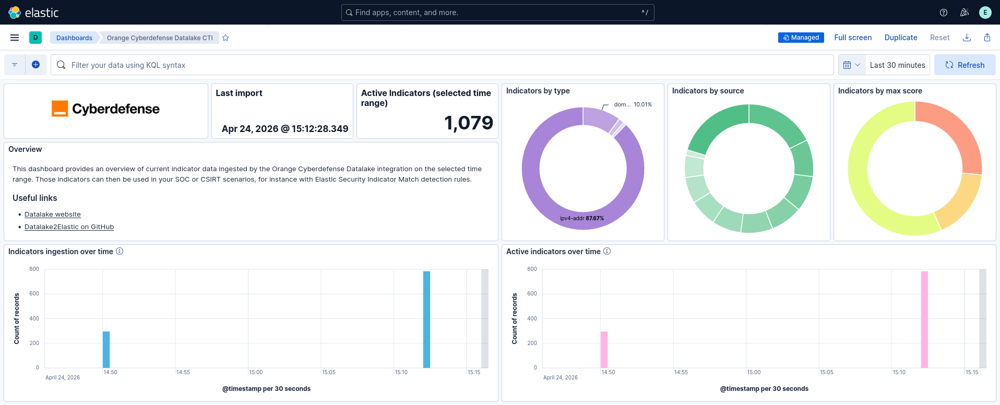
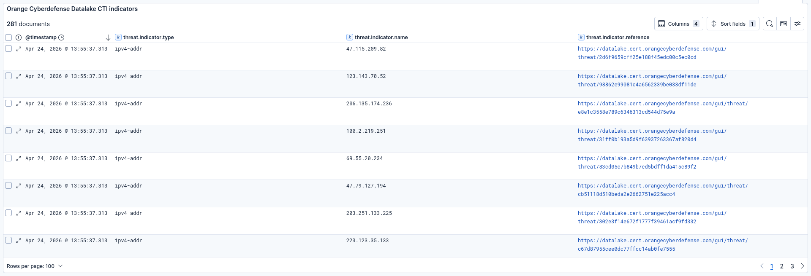

# Orange Cyberdefense Datalake Integration for Elastic

## Overview

Powered by Orange Cyberdefense Datalake, this threat intelligence integration feeds the Elastic Security stack with curated indicators — IP addresses, domains, URLs, email addresses, and file hashes — scored and enriched.

### Compatibility

This integration is compatible with Datalake API v3 and requires an active Datalake account with a "long term" token. The account must have the `bulk_search` permission.

### How it works

The integration uses a CEL input to periodically query the Datalake Bulk Search API. For each configured query hash, it:

1. **Creates a bulk search task** via `POST /api/v3/mrti/bulk-search/` with the query hash and STIX export options.
2. **Polls the task** via `GET /api/v3/mrti/bulk-search/task/{uuid}` until results are ready or the task fails.
3. **Extracts STIX indicators** from the returned ZIP archive and sends them through the ingest pipeline, which maps them to ECS `threat.indicator.*` fields.

Multiple query hashes can be configured in a single policy to fetch indicators from several saved Datalake queries at once.

An [Elastic Transform](https://www.elastic.co/guide/en/elasticsearch/reference/current/transforms.html) is created to provide a view of active indicators for end users. This transform creates destination indices that are accessible via the alias `logs-ti_orangecyberdefense_datalake_latest.indicator`. When querying for active indicators or setting up indicator match rules, use that alias to avoid false positives from expired indicators.

## What data does this integration collect?

The Orange Cyberdefense Datalake integration collects the following data:

* **Indicators** (`indicator` dataset) — Threat indicators in STIX format, converted to ECS-compatible fields. Supported indicator types:

    | Indicator type | ECS field |
    | --- | --- |
    | `ipv4-addr` / `ipv6-addr` | `threat.indicator.ip` |
    | `domain-name` | `threat.indicator.url.domain` |
    | `email-addr` | `threat.indicator.email.address` |
    | `file` | `threat.indicator.file.hash.{md5,sha1,sha256,sha512}` |
    | `url` | `threat.indicator.url.full` |

Each indicator also includes Datalake-specific metadata under `ti_orangecyberdefense_datalake`:
- `query_hash` — which query produced this indicator
- `indicator.x_datalake_score` — per-threat-type scores from Datalake
- `indicator.created` / `indicator.modified` — indicator timestamps
- `indicator.external_references` — direct link back to the indicator in Datalake

### Supported use cases

- Automated indicator matching against your logs using Elastic's threat intelligence detection rules
- Threat hunting and alert enrichment with CTI context during investigations
- Monitoring ingestion health and indicator coverage through the included dashboard

## What do I need to use this integration?

- An **Elastic deployment** with a configured **Elastic Agent**.
- A **Datalake account** with the `bulk_search` API permission.
  - A **Datalake long-term API token** for this account — generate one from the [My Account](https://datalake.cert.orangecyberdefense.com/gui/my-account) page.
- One or more **Datalake query hashes** — these identify saved searches in Datalake. To obtain a query hash, see the relevant section of the Datalake FAQ.

> **Note:** Make sure your Datalake query uses a time filter that aligns with the integration's polling interval. For example, if the integration polls every 15 minutes, your query should cover at least the last 15 minutes to avoid missing indicators.

## How do I deploy this integration?

### Agent-based deployment

Elastic Agent must be installed. For more details, check the Elastic Agent [installation instructions](docs-content://reference/fleet/install-elastic-agents.md). You can install only one Elastic Agent per host.

Elastic Agent is required to stream data from the Datalake API and ship it to Elastic, where events are processed via the integration's ingest pipelines.

### Onboard and configure

Add the integration from the **Integrations** page in Kibana by searching for **Orange Cyberdefense Datalake**. You will need to provide your Datalake long-term token and one or more query hashes. The **Datalake URL** field is pre-filled with the production endpoint and only needs to be changed for testing purposes (e.g. to point at a pre-production Datalake instance).

Note: By default, the field `threat.indicator.reference` is not clickable in Kibana. You can change this behavior by setting "Url" for the format of this field in the relevant data view settings (`logs-*` for the provided dashboard).

### Validation

#### Dashboards populated

1. In the top search bar in Kibana, search for **Dashboards**.
2. In the search bar, type **Orange Cyberdefense Datalake**.
3. Open a dashboard and verify that indicator data is populated.

#### Transforms healthy

1. In the top search bar in Kibana, search for **Transforms**.
2. Select **Data / Transforms** from the search results.
3. In the search bar, type **ti_orangecyberdefense_datalake**.
4. The `latest_ioc` transform should show a **Healthy** status.

## Troubleshooting

For help with Elastic ingest tools, check [Common problems](https://www.elastic.co/docs/troubleshoot/ingest/fleet/common-problems).

| Symptom | Possible cause | Resolution |
| --- | --- | --- |
| HTTP 429 errors in logs | API rate limit exceeded | Lower the **Rate Limit** setting (default is `0.1` req/s, i.e. 6 requests per minute) |
| No indicators ingested | Invalid or expired query hash | Verify the query hash still returns results in the Datalake UI |
| No indicators ingested | Mismatched time filters | Ensure the Datalake query's time filter covers at least the integration's polling interval |
| No indicators ingested | Expired API token | Generate a new long-term token from your Datalake account |
| No indicators ingested | Bulk search creation or polling failed | Enable debug mode (see below) and look for `Error:`-prefixed state messages — common causes are authentication issues or invalid query hashes |

### Enabling debug mode

By default, internal state messages emitted by the integration (cycle progress, task lifecycle, HTTP errors) are dropped at the ingest pipeline. To surface them for troubleshooting:

1. Edit the integration policy in Kibana.
2. Toggle **Enable debug messages** on.
3. Save and deploy the updated policy.

Once enabled, state messages are indexed alongside indicators in the same data stream. They can be filtered with `event.kind: "state"`. Error events specifically are prefixed with `Error:` in the `message` field. Turn debug mode off again once you're done to avoid polluting the index.

## Scaling

For more information on architectures that can be used for scaling this integration, check the [Ingest Architectures](https://www.elastic.co/docs/manage-data/ingest/ingest-reference-architectures) documentation.

## Reference

### Inputs used

| Input type | Description |
| --- | --- |
| CEL | Polls the Datalake Bulk Search API at a configurable interval |

### Exported fields

Most of the relevant indicators data is mapped to ECS (primarily `threat.indicator.*`). Some additional data is stored with the prefix `ti_orangecyberdefense_datalake.*`.

Timestamps are mapped as follows:

| Source                                              | Destination                   | Description |
|-----------------------------------------------------|-------------------------------|-------------|
| -                                                   | @timestamp                    | Time the event was received by the Elasticsearch pipeline |
| -                                                   | event.ingested                | Time the event arrived in the Elasticsearch central data store |
| ti_orangecyberdefense_datalake.indicator.created    | -                             | Time of the indicator's creation in Datalake |
| ti_orangecyberdefense_datalake.indicator.modified   | threat.indicator.modified_at  | Time of the indicator's last modification in Datalake |
| ti_orangecyberdefense_datalake.indicator.valid_from | -                             | Time from which the indicator is valid (here, always identical to `modified_at`) |

The documentation for ECS fields can be found at:
- [ECS Event Fields](https://www.elastic.co/guide/en/ecs/current/ecs-event.html)
- [ECS Threat Fields](https://www.elastic.co/guide/en/ecs/current/ecs-threat.html)

**Exported fields**

| Field | Description | Type |
|---|---|---|
| @timestamp | Time the event was received by the pipeline. | date |
| data_stream.dataset | Data stream dataset name. | constant_keyword |
| data_stream.namespace | Data stream namespace. | constant_keyword |
| data_stream.type | Data stream type. | constant_keyword |
| event.ingested | Timestamp when an event arrived in the central data store. This is different from `@timestamp`, which is when the event originally occurred.  It's also different from `event.created`, which is meant to capture the first time an agent saw the event. In normal conditions, assuming no tampering, the timestamps should chronologically look like this: `@timestamp` \< `event.created` \< `event.ingested`. | date |
| event.kind | This is one of four ECS Categorization Fields, and indicates the highest level in the ECS category hierarchy. `event.kind` gives high-level information about what type of information the event contains, without being specific to the contents of the event. For example, values of this field distinguish alert events from metric events. The value of this field can be used to inform how these kinds of events should be handled. They may warrant different retention, different access control, it may also help understand whether the data is coming in at a regular interval or not. | keyword |
| event.original | Raw text message of entire event. Used to demonstrate log integrity or where the full log message (before splitting it up in multiple parts) may be required, e.g. for reindex. This field is not indexed and doc_values are disabled. It cannot be searched, but it can be retrieved from `_source`. If users wish to override this and index this field, please see `Field data types` in the `Elasticsearch Reference`. | keyword |
| input.type | Input type. | keyword |
| labels.is_ioc_transform_source | Indicates whether an IOC is in the raw source data stream, or the in latest destination index. | constant_keyword |
| threat.feed.description | Description of the threat feed in a UI friendly format. | keyword |
| threat.feed.name | The name of the threat feed in UI friendly format. | keyword |
| threat.feed.reference | Reference information for the threat feed in a UI friendly format. | keyword |
| threat.indicator.confidence | Identifies the vendor-neutral confidence rating using the None/Low/Medium/High scale defined in Appendix A of the STIX 2.1 framework. Vendor-specific confidence scales may be added as custom fields. | keyword |
| threat.indicator.email.address | Identifies a threat indicator as an email address (irrespective of direction). | keyword |
| threat.indicator.file.hash.md5 | MD5 hash. | keyword |
| threat.indicator.file.hash.sha1 | SHA1 hash. | keyword |
| threat.indicator.file.hash.sha256 | SHA256 hash. | keyword |
| threat.indicator.file.hash.sha512 | SHA512 hash. | keyword |
| threat.indicator.first_seen | The date and time when intelligence source first reported sighting this indicator. | date |
| threat.indicator.id | The ID of the indicator used by this threat to conduct behavior commonly modeled using MITRE ATT&CK®. This field can have multiple values to allow for the identification of the same indicator across systems that use different ID formats. While not required, a common approach is to use a STIX 2.x indicator ID. | keyword |
| threat.indicator.ip | Identifies a threat indicator as an IP address (irrespective of direction). | ip |
| threat.indicator.last_seen | The date and time when intelligence source last reported sighting this indicator. | date |
| threat.indicator.modified_at | The date and time when intelligence source last modified information for this indicator. | date |
| threat.indicator.name | The display name indicator in an UI friendly format URL, IP address, email address, registry key, port number, hash value, or other relevant name can serve as the display name. | keyword |
| threat.indicator.reference | Reference URL linking to additional information about this indicator. | keyword |
| threat.indicator.type | Type of indicator as represented by Cyber Observable in STIX 2.0. | keyword |
| threat.indicator.url.domain | Domain of the url, such as "www.elastic.co". In some cases a URL may refer to an IP and/or port directly, without a domain name. In this case, the IP address would go to the `domain` field. If the URL contains a literal IPv6 address enclosed by `[` and `]` (IETF RFC 2732), the `[` and `]` characters should also be captured in the `domain` field. | keyword |
| threat.indicator.url.full | If full URLs are important to your use case, they should be stored in `url.full`, whether this field is reconstructed or present in the event source. | wildcard |
| threat.indicator.url.full.text | Multi-field of `threat.indicator.url.full`. | match_only_text |
| threat.indicator.url.original | Unmodified original url as seen in the event source. Note that in network monitoring, the observed URL may be a full URL, whereas in access logs, the URL is often just represented as a path. This field is meant to represent the URL as it was observed, complete or not. | wildcard |
| threat.indicator.url.original.text | Multi-field of `threat.indicator.url.original`. | match_only_text |
| ti_orangecyberdefense_datalake.indicator | The STIX indicator object from Datalake | object |
| ti_orangecyberdefense_datalake.indicator._computed.score_max | Computed at ingest time. Highest score across all threat categories. | byte |
| ti_orangecyberdefense_datalake.indicator._computed.sources | Computed at ingest time. Union of source_id values from x_datalake_sources, x_datalake_sighting_sources, and x_datalake_whitelist_sources. | keyword |
| ti_orangecyberdefense_datalake.indicator.created | Time of the indicator's creation in Datalake | date |
| ti_orangecyberdefense_datalake.indicator.external_references | External references to the indicator | flattened |
| ti_orangecyberdefense_datalake.indicator.modified | Time of the indicator's last modification in Datalake | date |
| ti_orangecyberdefense_datalake.indicator.valid_from | Time from which the indicator is valid | date |
| ti_orangecyberdefense_datalake.indicator.x_datalake_score | Per-threat-category scores (0-100), e.g. malware, phishing, scam | object |
| ti_orangecyberdefense_datalake.indicator.x_datalake_sighting_sources | Sighting sources for this indicator | flattened |
| ti_orangecyberdefense_datalake.indicator.x_datalake_sources | Sources for this indicator | flattened |
| ti_orangecyberdefense_datalake.indicator.x_datalake_whitelist_sources | Whitelist sources for this indicator | flattened |
| ti_orangecyberdefense_datalake.query_hash | The Datalake query hash that produced the indicator | keyword |

